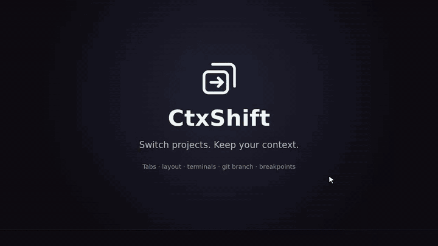
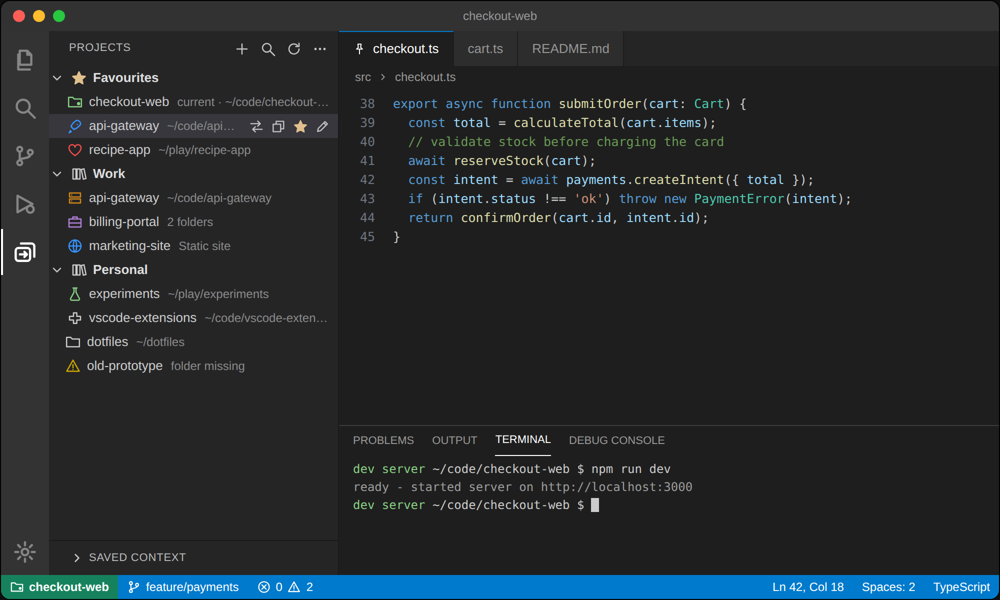
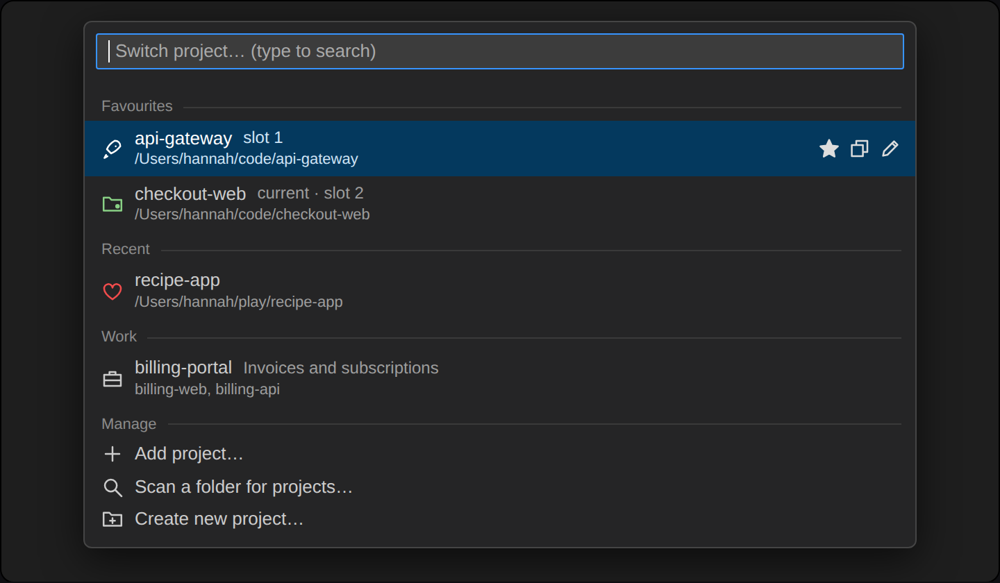
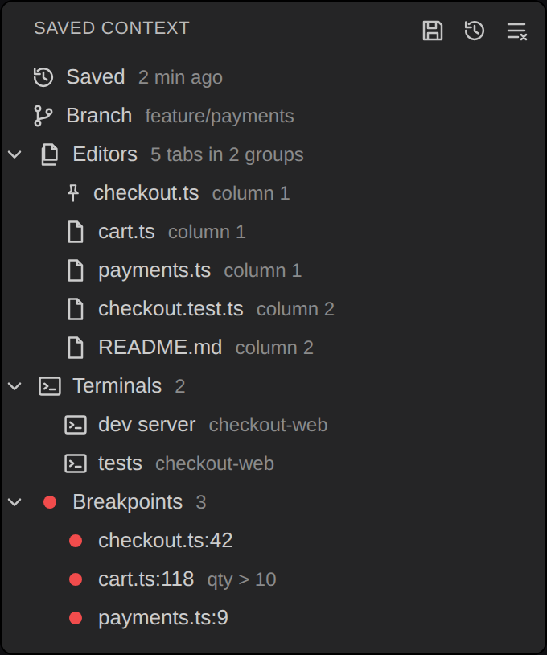
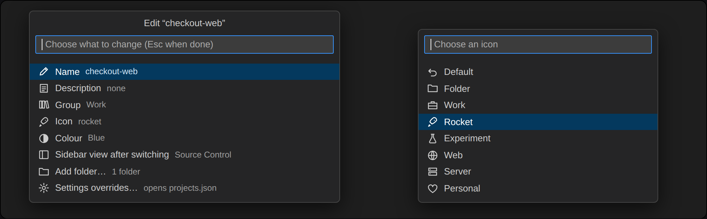

# CtxShift

Switch between project folders in one click, and get each one back **exactly as you left it**: open tabs, editor layout, terminals, git branch and breakpoints.

Part of the CodeMaman extension family, alongside [OAuth token generator, Branch Viewer, Ai Coauthoring Tracker, and more](https://marketplace.visualstudio.com/publishers/CodeMaman).

*Animated mockup with demo projects. A full-quality version is in `media/demo.mp4`.*

*Screenshots in this README are illustrative mockups using demo projects.*

## Quick start

1. Open the **CtxShift** icon in the activity bar, or press `Cmd+Alt+P` (`Ctrl+Alt+P` on Windows/Linux).
2. Add projects: **Add Current Folder**, **Add Project…**, **Scan Folder for Projects…** (finds every repo in a folder like `~/code`) or **Create New Project…**.
3. Click a project. CtxShift saves the context of the project you are leaving, opens the new one in the **same window**, and restores its saved context.

The status bar shows the current project; click it to switch.

### Keyboard shortcuts

| Shortcut (Mac / Windows, Linux) | Action |
| --- | --- |
| `Cmd+Alt+P` / `Ctrl+Alt+P` | Switch project (searchable list) |
| `Cmd+Alt+O` / `Ctrl+Alt+O` | Jump back to the previous project |
| `Cmd+Alt+1`…`9` / `Ctrl+Alt+1`…`9` | Jump straight to your 1st…9th favourite |

Favourites are numbered in the order they appear in the switcher. Rebind any of these in Keyboard Shortcuts (search "CtxShift").

## What is saved and restored

| Context | Details |
| --- | --- |
| Tabs | Which files are open, their order, pinned tabs, the active tab in each group, cursor position and scroll position |
| Layout | Editor splits (columns and rows) |
| Terminals | Names and working directories (recreated; running processes are not restarted) |
| Git branch | The checked-out branch, restored on return (skipped if the tree has uncommitted changes) |
| Breakpoints | Source and function breakpoints, including conditions, hit counts and log messages |
| Sidebar | Optionally the sidebar view (Explorer, Search, Source Control…) you choose per project |

Context is kept up to date as you work (a few seconds after each change), so it survives closing VS Code as well as switching. Each part can be turned off in settings.

The **Saved Context** view shows exactly what is stored for the current project.

## Managing projects

- **Drag and drop** to reorder, move a project into a group, or drop it on Favourites.
- **Groups** and **Favourites** keep long lists tidy. Favourites and recent projects float to the top of the switcher.
- **Edit Project…** (pencil) changes name, description, group, line icon, colour and sidebar view.
- **Multi-folder projects**: add several folders to one project and CtxShift opens them together as a multi-root workspace.
- **Existing `.code-workspace` files** can be added as projects.
- **Settings overrides**: add a `"settings": { ... }` object to a project in `projects.json` and those settings apply only while it is open.
- **Open in New Window** from the row or the switcher when you want two projects side by side.
- **Import / Export** projects as JSON. Import also understands the Project Manager extension's `projects.json`.

Right-click any project for the full menu.

## Settings

| Setting | Default | Description |
| --- | --- | --- |
| `ctxshift.restoreOnOpen` | `onSwitch` | `onSwitch`, `always` or `never` |
| `ctxshift.restore.editors` / `layout` / `terminals` / `branch` / `breakpoints` | `true` | Choose what is saved and restored |
| `ctxshift.restore.closeOtherEditors` | `true` | Close tabs not in the saved context first (never tabs with unsaved changes) |
| `ctxshift.autoSnapshot` | `true` | Keep the saved context current while you work |
| `ctxshift.saveAllBeforeSwitch` | `true` | Save unsaved files before switching |
| `ctxshift.showStatusBar` | `true` | Show the current project in the status bar |
| `ctxshift.projectsFile` | *(empty)* | Path to `projects.json`. Point it at a synced folder to share your list between machines |

## Good to know

- VS Code restarts extensions when a window changes folder, so CtxShift restores your context right after the new folder loads.
- VS Code does not let extensions read which sidebar or bottom-panel view is showing, so the sidebar view is a per-project choice rather than something captured automatically.
- Git branch restore never touches a working tree with uncommitted changes.
